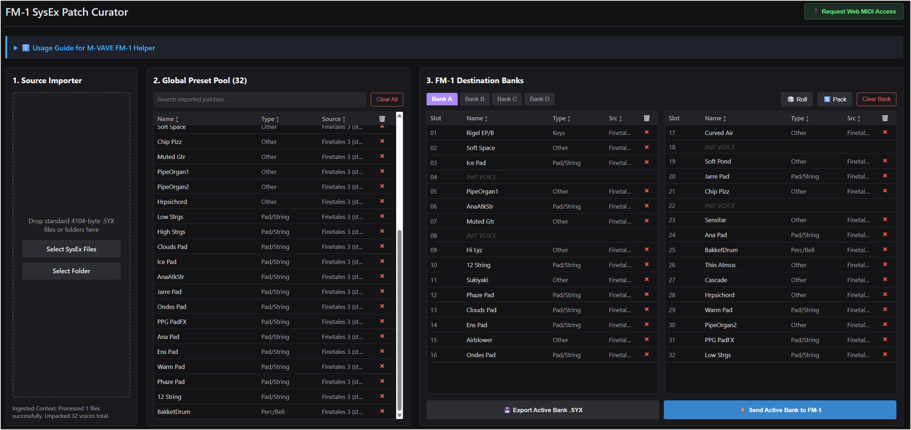

# M-Wave FM-1 SysEx Patch Curator Pro

A web-based utility designed for the **M-VAVE FM-1** that enables users to curate, manage, and compile custom DX7-compatible SysEx banks. This tool streamlines the process of ingesting voice data and preparing stable, bank-ready files for hardware transmission. [Start Here](https://grandsummoner.github.io/fm-1-helper/FM-1-Helper.html)

---

## Features

* **Drag-and-Drop Ingestion**: Easily load standard 4104-byte `.syx` or `.bin` files via drag-and-drop or folder selection.
* **Intelligent Bank Management**: Organize patches into four distinct banks (A–D) with 32 slots each.
* **Data Integrity**: Auto-fills empty destination slots with "INIT VOICE" data to prevent performance glitches or truncation errors.
* **Web MIDI Integration**: Directly transmit curated banks to your FM-1 hardware via the browser.
* **Sort & Compact**: Built-in sorting and packing utilities to maintain a clean workspace.

## How to Use

* **Request MIDI Access**: Click the **Request Web MIDI Access** button in the top right to link your FM-1 hardware.
* **Import Sources**: Drop your existing SysEx library files into the **Source Importer** panel.
* **Curate**:
    * Drag patches from the **Global Preset Pool** into your target slots in the **Destination Banks**.
    * Use the **🎲 Roll** button to randomize patches into a bank.
    * Use the **🔄 Pack** button to remove gaps and align patches.
* **Export/Send**:
    * Click **💾 Export Active Bank .SYX** to save a file to your disk.
    * Click **⚡ Send Active Bank to FM-1** to transmit the data directly via MIDI.

## Technical Specifications

| Feature | Specification |
| :--- | :--- |
| **Compatibility** | DX7 SysEx architecture (4104 bytes per bank) |
| **Browser Support** | Optimized for Chromium-based browsers (Chrome, Edge, Opera) |

## Troubleshooting

* **"No MIDI Hardware Found"**: Ensure your M-VAVE FM-1 is connected via USB and powered on before launching the application.
* **MIDI Port In Use**: If the MIDI send fails, ensure no other DAW or SysEx librarian software is occupying the MIDI port.
* **Browser Permissions**: Ensure your browser is allowed to access MIDI devices via the site settings.

---
